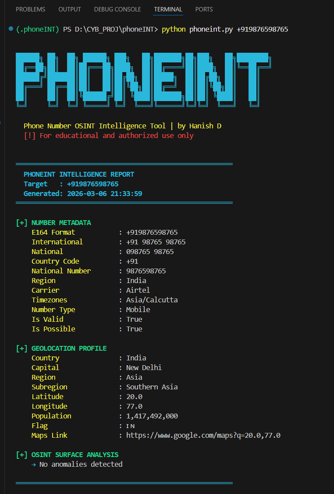

# PhoneINT 🔍
> Phone Number OSINT Intelligence Tool

A Python-based OSINT utility that performs carrier lookup, number validation, geolocation profiling, and surface-level intelligence analysis on a target phone number using open-source data sources — no paid API keys required.

---

## Features

-  Phone number validation and format normalization (E164, International, National)
-  Carrier and network type identification (Mobile, VoIP, Fixed Line, MVNO detection)
-  Country-level geolocation with coordinates, capital, region, population, and Google Maps link
-  Timezone resolution
-  OSINT surface analysis — flags anomalies like VoIP usage, unresolved carriers, or non-geographic numbers
-  JSON report export with `--export` flag
-  Clean terminal output with color-coded intelligence report

---

## Installation

```bash
git clone https://github.com/yourusername/phoneint.git
cd phoneint
pip install -r requirements.txt
```

### Requirements
```
phonenumbers
requests
```

Or install directly:
```bash
pip install phonenumbers requests
```

---

## Usage

**Interactive mode:**
```bash
python phoneint.py
```

**With argument:**
```bash
python phoneint.py +919876543210
```

**Export to JSON:**
```bash
python phoneint.py +919876543210 --export
```

---

## Sample Output

```
═══════════════════════════════════════════════════════
  PHONEINT INTELLIGENCE REPORT
  Target   : +919876543210
  Generated: 2025-09-01 14:32:11
═══════════════════════════════════════════════════════

[+] NUMBER METADATA
    E164 Format           : +919876543210
    International         : +91 98765 43210
    National              : 098765 43210
    Country Code          : +91
    Region                : India
    Carrier               : Airtel
    Timezones             : Asia/Calcutta
    Number Type           : Mobile
    Is Valid              : True

[+] GEOLOCATION PROFILE
    Country               : India
    Capital               : New Delhi
    Region                : Asia
    Subregion             : Southern Asia
    Latitude              : 20.0
    Longitude             : 77.0
    Population            : 1,380,004,385
    Maps Link             : https://www.google.com/maps?q=20.0,77.0

[+] OSINT SURFACE ANALYSIS
    → No anomalies detected
═══════════════════════════════════════════════════════
```

---



## Disclaimer

> This tool is intended for **educational purposes and authorized OSINT investigations only**.  
> Misuse of this tool to target individuals without consent may violate laws in your jurisdiction.  
> The author is not responsible for any misuse.

---

## Author

**Hanish D** — Cybersecurity Researcher | [GitHub](https://github.com/hanishdevaraj007) | [LinkedIn](https://linkedin.com/in/hanishd)
